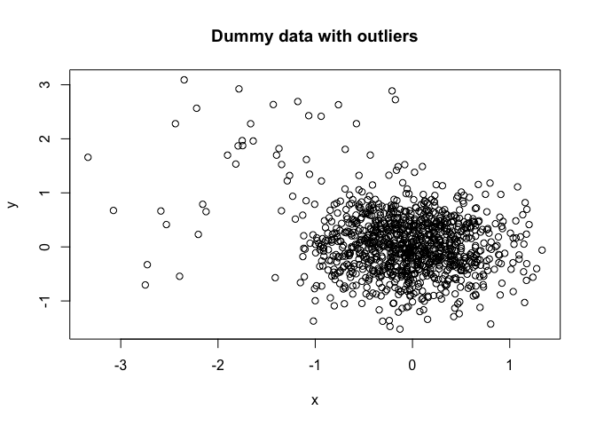
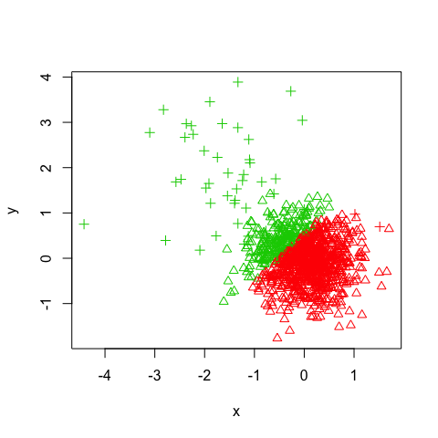
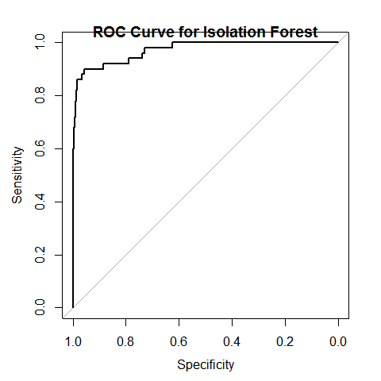

Isolation Forest
----------------

An Isolation Forest is an ensemble of completely random decision trees.
At each split a random feature and a random split point is chosen.
Anomalies are isolated if they end up in a partition far away from the
rest of the data. In decision tree terms, this corresponds to a record
that has a short "path length". The path length is the number of nodes
that a record passes through before terminating in a leaf node. Records
with short average path lengths through the entire ensemble are
considered anomalies.

An analogy
----------

Describing the location of a country home takes many fewer directions
than describing the location of a brownstone in Brooklyn. The country
home might be described as "the only house on the south shore of Lake
Woebegon". While directions to the brownstone must be qualified with
much more detail: "Go north on 5th Street for 12 blocks, take a left on
Van Buren, etc.."

<table style="width:78%;">
<colgroup>
<col width="38%" />
<col width="38%" />
</colgroup>
<thead>
<tr class="header">
<th align="center">Isolated</th>
<th align="center">Dense</th>
</tr>
</thead>
<tbody>
<tr class="odd">
<td align="center"></td>
<td align="center"></td>
</tr>
</tbody>
</table>

The country house in this example is a literal outlier. It is off by
itself away from most other homes. Similarly, records that can be
described succinctly are also outliers.

Example
-------

Here we create two random, normal vectors and add some outliers. The
majority of the data points are centered around (0, 0) with a standard
deviation of 1/2. 50 outliers are introduced and are centered around
(-1.5, 1.5) with a standard deviation of 1. This is to encourage some
co-mingling of outliers with the bulk of the data.

    N = 1e3
    x = c(rnorm(N, 0, 0.5), rnorm(N*0.05, -1.5, 1))
    y = c(rnorm(N, 0, 0.5), rnorm(N*0.05,  1.5, 1))
    ol = c(rep(0, N), rep(1, (0.05*N))) + 2
    data = data.frame(x, y)
    plot(data, pch=ol)
    title("Dummy data with outliers")

The code below builds an Isolation Forest by passing in the dummy data,
the number of trees requested (100) and the number of records to
subsample for each tree (32). The records that exceed the 95% percentile
of the anomaly score should flag the most anomalous records. By coloring
such records as red and plotting the results the effectiveness of the
Isolation Forest can be viewed.

    mod = iForest(X = data, 100, 32)
    p = predict(mod, data)
    col = ifelse(p > quantile(p, 0.95), "red", "blue")
    plot(x, y, col=col, pch=ol)

Knowing there are two populations, the Kmeans algorithm seems like a
good fit for identifying the two clusters. However, we can see that it
picks cluster centers that do not do a good job of separating the data.

    km = kmeans(data, 2)
    plot(x, y, col=km$cluster+1, pch=ol)

Comparison of Results
---------------------

We can compare the accuracy of identifying outliers by comparing the
confusion matrix for each classification.

    table(iForest=p  > quantile(p, 0.95), Actual=ol == 3)

    ##        Actual
    ## iForest FALSE TRUE
    ##   FALSE   987   10
    ##   TRUE     13   40

    table(KMeans=km$cluster == 1, Actual=ol == 3)

    ##        Actual
    ## KMeans  FALSE TRUE
    ##   FALSE   282   49
    ##   TRUE    718    1

ROC Curve
---------

    r = pROC::roc(ol == 3, p)
    plot(r)

    ## 
    ## Call:
    ## roc.default(response = ol == 3, predictor = p)
    ## 
    ## Data: p in 1000 controls (ol == 3 FALSE) < 50 cases (ol == 3 TRUE).
    ## Area under the curve: 0.9715

    title("ROC Curve for Isolation Forest")

